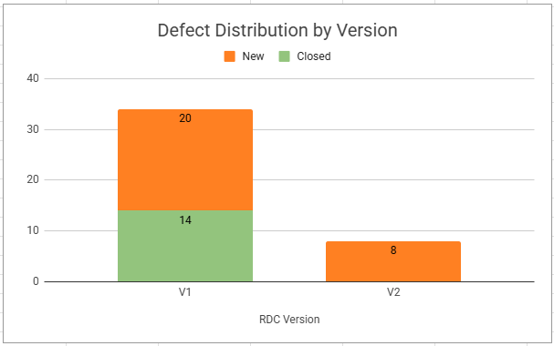
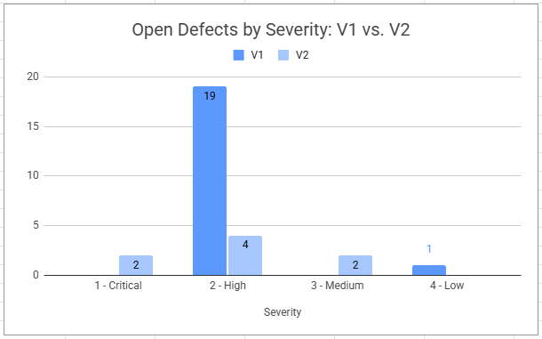

## RDC (Retail Discount Calculator) - E2E Testing Project

### Project Overview
This project focused on the end-to-end testing and quality assurance of the RDC system, a discount management application for the "DIY for Home" retail chain. The project scope was defined by specific functional requirements, which I analyzed and tested to ensure system reliability.
Note: All test documentation was authored in Hebrew, in compliance with specific academic project requirements for localized quality assurance reporting.

### Key QA Contributions
* **Test Planning & Collaboration:** Co-authored the Software Test Plan (STP), working within a team to define test strategies, scope, and exit criteria.
* **Execution & Traceability:** Designed and executed 100+ test cases. I managed a dedicated Traceability Matrix to ensure 100% coverage of the functional areas defined within our project scope.
* **Defect Lifecycle & Regression:** Managed 42+ defects using Jira. This included identifying critical regression issues and verifying bug fixes in version 1.0.1.0.
* **Data Analysis & Insights:** Utilized Pivot Tables and data visualization to analyze defect distribution. This provided clear insights into system stability and highlighted high-risk areas.
* **Strategic Reporting:** Co-authored the final Software Test Report (STR), providing a data-backed "No-Go" recommendation based on defect density and quality gate analysis.

### Documentation
* [Software Test Plan (STP)](docs/RDC_Test_Plan.pdf)
* [Traceability Matrix (PDF)](docs/RDC_Traceability_Matrix.pdf)
* [Software Test Report (STR)](docs/RDC_Test_Report.pdf)

---
### QA Insights & Data Analysis
This section presents key metrics regarding test execution and defect management to illustrate the quality assessment of the RDC project.

**1. Defect Distribution by Version**

The following chart compares defect volume between V1 and V2, highlighting the shift in defect trends and closure rates.

**2. Open Defects by Severity (V1 vs. V2)**

This analysis identifies the severity breakdown of open defects. The introduction of critical bugs in V2, which were absent in V1, supports the rationale for the 'No-Go' decision.

