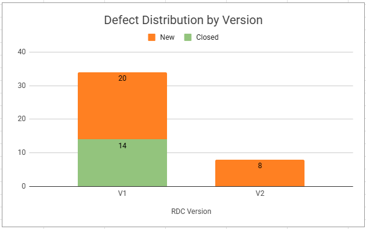
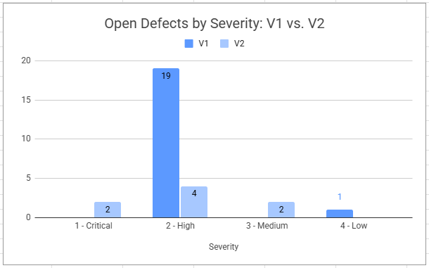
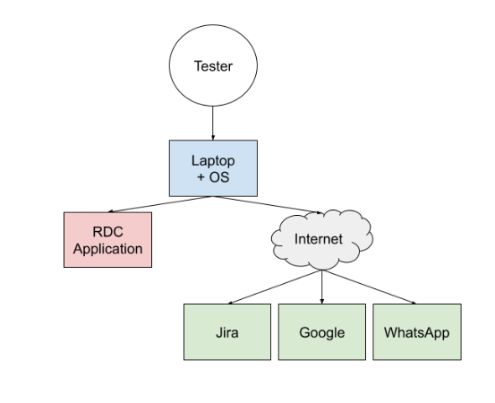

## RDC (Retail Discount Calculator) | E2E Testing Project

A manual QA testing project focused on requirements-based test planning and defect lifecycle management for a retail discount management application.


Notice: Original project specifications and guidelines are restricted course materials and cannot be published. The scope is limited to the testing artifacts produced by the authors. Also, please note that all test documentation is authored in Hebrew, complying with specific academic requirements.


### Project Overview
The Retail Discount Calculator (RDC) system is designed to serve cashiers in "DIY for Home" stores, which features 3 main departments: lighting, carpentry and plumbing. The purpose of the program is to help cashiers calculate discounts according to the various guidelines practiced in the store. 

This project centers on the end-to-end testing and quality assurance of the RDC system within a collaborative team environment, utilizing requirement-based test planning to drive execution and analysis phases for system readiness evaluation.


### Project Structure
```text
├── docs/
│   ├── RDC_Test_Plan.pdf
│   ├── RDC_Test_Report.pdf
│   └── RDC_Traceability_Matrix.pdf
├── images/
│   ├── RDC_Defect_Distribution_by_Version.png
│   ├── RDC_Open_Defects_by_Severity_V1_vs_V2.png
│   └── RDC_Test_Environment_Architecture.png
└── README.md
```

### Documentation
* [Software Test Plan (STP)](docs/RDC_Test_Plan.pdf)
* [Software Test Report (STR)](docs/RDC_Test_Report.pdf)
* [Traceability Matrix (PDF)](docs/RDC_Traceability_Matrix.pdf)

---
### Key QA Contributions
* **Test Planning & Collaboration:** Co-authored the Software Test Plan (STP), working within a team to define test strategies, scope, and exit criteria.
* **Execution & Traceability:** Designed and executed 100+ test cases. I managed a dedicated Traceability Matrix to ensure 100% coverage of the functional areas defined within our project scope.
* **Defect Lifecycle & Regression:** Managed 42+ defects using Jira. This included identifying critical regression issues and verifying bug fixes in version 1.0.1.0.
* **Data Analysis & Insights:** Utilized Pivot Tables and data visualization to analyze defect distribution. This provided clear insights into system stability and highlighted high-risk areas.
* **Strategic Reporting:** Co-authored the final Software Test Report (STR), providing a data-backed "No-Go" recommendation based on defect density and quality gate analysis.


### QA Insights & Data Analysis
This section presents key metrics regarding test execution and defect management to illustrate the quality assessment of the RDC project.

**1. Defect Distribution by Version**

The following chart compares defect volume between V1 and V2, highlighting the shift in defect trends and closure rates.



**2. Open Defects by Severity (V1 vs. V2)**

This analysis identifies the severity breakdown of open defects. The introduction of critical bugs in V2, which were absent in V1, supports the rationale for the 'No-Go' decision.



### Test Environment Architecture
The following diagram illustrates the testing environment architecture, representing the interaction between the RDC application, the testing workstation, and external integration tools




### Test Management & Tools

The QA lifecycle for the RDC system was managed using **Jira** integrated with **Xray**:

* **Test Planning & Design:** Structured requirements breakdown, creation of Test Cases, and organization of Test Sets mirroring the three store departments (Lighting, Carpentry, and Plumbing).
* **Execution & Defect Lifecycle:** Managed test runs, logged defects, and tracked the full defect lifecycle from discovery to fix verification.
* **Traceability & Coverage:** Maintained end-to-end requirement-to-test and defect-to-test traceability.
---
### Authors

* Ofek Katz
* Ofir Zion

*This project was completed in February 2026 as part of the Software QA and Automation course at John Bryce* 
